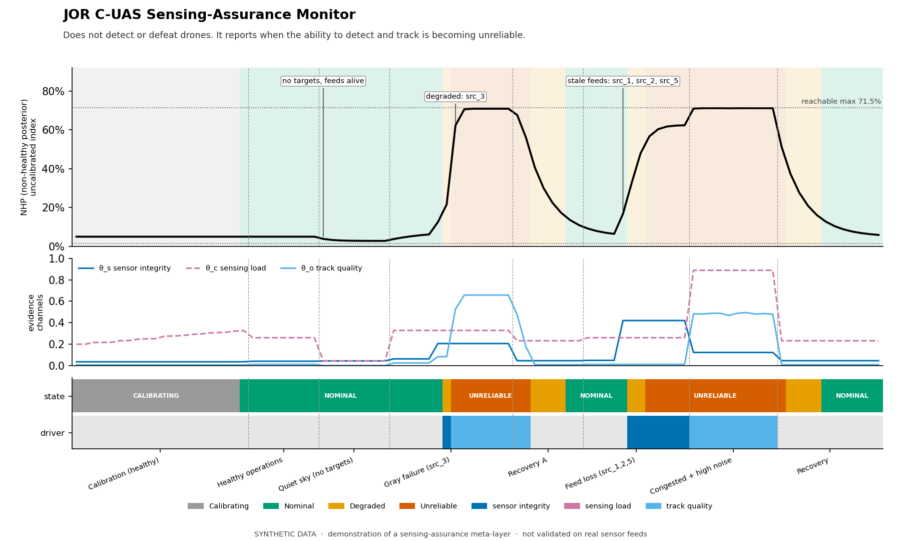

# JOR C-UAS Sensing-Assurance Prototype

A lightweight **meta-layer for counter-drone defence**. It does **not** detect, classify, or defeat drones, and it makes no statement about threat level. It watches the *quality* of the detect-and-track picture and tells an operator, or a higher-level C2 system, when the ability to detect and track is becoming unreliable.

> **Status: research prototype, synthetic data only.** Nothing here has been validated against real sensor feeds. Do not use it for operational decisions. See [Limitations](#limitations).



*One demo run: calibration, healthy operation, quiet sky, a single degraded source, recovery, loss of three sensor feeds, a congested noisy picture, and recovery. Top: NHP (non-healthy posterior). Middle: the three evidence channels. Bottom: state band and the channel driving it.*

---

## Contents

1. [What it does](#what-it-does)
2. [Quick start](#quick-start)
3. [How it works](#how-it-works)
4. [The status report (C2 payload)](#the-status-report-c2-payload)
5. [The demo scenarios](#the-demo-scenarios)
6. [Validation](#validation)
7. [Using it in your own code](#using-it-in-your-own-code)
8. [Visualisations](#visualisations)
9. [Files](#files)
10. [Configuration reference](#configuration-reference)
11. [Limitations](#limitations)
12. [License](#license)

---

## What it does

Counter-UAS sensing picks up targets only if the sensors, the data links, and the processing chain are healthy. Those can degrade quietly: one radar sector loses track continuity, a feed goes stale, the RF environment saturates, noise climbs. Detection can look fine in aggregate while coverage is already compromised.

This layer consumes only **quality metadata**, not track positions or target identities, and produces:

- a **state band**: `NOMINAL`, `DEGRADED`, or `UNRELIABLE` (plus `CALIBRATING` at start-up)
- **NHP**, a posterior-style index that detect/track capability is degraded
- **attribution**: which evidence channel is driving the change, and which sources are degraded, stale, or malformed
- a **JSON status report** suitable for an operator display or C2 link, with a staleness helper so a silent monitor is itself treated as a fault

It is derived from the [JOR evidence-fusion engine](https://github.com/jamesorion6869/JOR_PYMC_V3_1), adapted here from a service-health demo to sensing assurance.

## Quick start

**Requirements:** Python 3 and `numpy`. The visualisations additionally need `matplotlib`, plus `ffmpeg` (or `pip install imageio-ffmpeg`) for mp4 output. Without ffmpeg, `viz.py` writes a GIF instead. The core demo never imports matplotlib. Developed and tested on Python 3.12.

```bash
pip install numpy                 # core
pip install matplotlib            # optional: figures and replay
pip install imageio-ffmpeg        # optional: mp4 if you have no system ffmpeg

python cuas_demo.py               # run the demo (seed 42)
python cuas_demo.py --viz         # ...and write cuas_timeline.png
python cuas_demo.py --video       # ...and write cuas_replay.mp4
python cuas_demo.py --resume      # restore engine state, skip calibration
python cuas_demo.py --seed 7      # different random draw
```

```bash
python viz.py                                      # latest run in the log -> cuas_timeline.png
python viz.py cuas_airspace_log.jsonl --png t.png --video replay.mp4
python viz.py --all                                # draw every run in the log
python viz.py --run 20261007-075408-c8ec           # draw a specific run
```

```bash
python -m pytest test_patches.py                   # 33 unit tests (needs pytest)
python soak_test.py                                # full soak, several minutes
python soak_test.py --drift-only                   # slow-drift scenarios only
```

The demo writes `cuas_airspace_log.jsonl` (appended on every run, one `run_id` per run) and `cuas_engine_state.json` (read only with `--resume`) to the current directory.

## How it works

### Three evidence channels

| Channel | Key in status report | What it measures |
|---|---|---|
| **θ_s** | `sensor_integrity` | Sensor and platform health, data-link and backlog, **feed liveness** (heartbeats) |
| **θ_c** | `sensing_load` | Load on the sensing system: track-volume saturation, RF occupancy, non-cooperative share. *Not* a threat estimate |
| **θ_o** | `track_quality` | Track continuity, classification confidence, noise floor, false-alarm rate, and per-source anomalies |

Each is normalised to 0–1 by the adapter (`cuas_adapter.py`). The engine fuses them into the **System Operating Picture** (SOP):

```
SOP = 0.35·θ_s + 0.25·θ_c + 0.40·θ_o
```

Track quality has the largest weight because it is the earliest and most direct indicator of degraded awareness. The weights live in one place (`JOREngine.CHANNEL_WEIGHTS`) and drive both the fusion and the per-channel attribution.

### No targets is not no data

In quiet sky, empty track lists are normal. The adapter keeps three situations apart:

| Situation | Treated as | Flag |
|---|---|---|
| Feeds alive, nothing to track | Neutral (only the noise floor contributes) | `no_targets` |
| Feed stale (no heartbeat within the timeout), malformed, or absent | Degraded (`theta_o` = 0.60 if nothing usable remains) | `data_missing`, plus `stale_sources` / `malformed_sources` |
| Feed alive, track quality poor | Scored normally | none |

This needs a real **liveness signal** (per-sensor heartbeat ages). Track counts alone cannot distinguish a quiet sky from a silent feed.

### Per-source anomalies

A single degraded radar sector or RF channel can hide in the aggregate. The adapter compares each source's median continuity with the fleet:

- score = (fleet median − source median) / IQR, with the IQR floored (`min_iqr`) and the score capped (`max_iqr_score`) so one catastrophic sample cannot saturate it
- scores feed an exponential moving average per source
- a source counts as **persistent** only after `persistence_steps` consecutive steps above threshold, and only persistent sources lift `theta_o` and appear in `degraded_sources`

A common-mode degradation (all sources drift together) produces no outliers by design; it shows up in the aggregate `theta_o` instead.

### The engine

`engine.py` runs a recursive update each step:

1. **Calibrate.** The first `calibration_steps` steps (default 20) set the baseline SOP, using the median and a robust spread. A `calibration_suspect` flag is raised if the window contains outliers. Per-channel baselines are stored for attribution. The demo calibrates across a *ramp* of normal loads rather than a single quiet snapshot.
2. **Dead-band.** `delta = SOP − baseline`; excursions smaller than `delta_deadband` (0.02 in the demo) are treated as normal operating variation.
3. **Update.** Posterior odds are the prior odds times `exp(steepness · delta)`, i.e. a log-odds shift.
4. **Retention blend.** `NHP = retention · posterior + (1 − retention) · prior_nh`. This stabilises the state and bounds it to `[(1−retention)·prior, retention + (1−retention)·prior]`, which is **1.5%–71.5%** with the defaults. NHP can never display 100%.
5. **Bands with hysteresis.**
   - `UNRELIABLE`: enters at NHP > 0.55, clears below 0.45
   - `DEGRADED`: enters at NHP ≥ 0.20, clears below 0.15
   - otherwise `NOMINAL`
6. **Fail-safe on bad inputs.** Non-finite thetas never reach the posterior. The state is held, `data_fault` is set, and after `fault_alert_steps` (3) consecutive faults the alert forces ON: no data means no assurance.

> **NHP is an index, not a probability.** It follows Bayesian update arithmetic but is not calibrated against ground truth. Read it as "how far from baseline, accumulated over recent steps".

## The status report (C2 payload)

`engine.status(ts, details)` returns a JSON-safe dict:

```json
{"ts": 92.0, "state": "NOMINAL", "nhp": 0.0591, "nhp_range": [0.015, 0.715],
 "sop": 0.0774, "baseline_sop": 0.0805, "alert": false, "data_fault": false,
 "consecutive_faults": 0, "dominant_channel": null,
 "channel_excess": {"sensor_integrity": 0.0035, "sensing_load": -0.0079, "track_quality": 0.0012},
 "details": {}}
```

| Field | Meaning |
|---|---|
| `state` | `CALIBRATING`, `NOMINAL`, `DEGRADED`, or `UNRELIABLE` |
| `nhp`, `nhp_range` | The index and its reachable range |
| `sop`, `baseline_sop` | Current fused value and the calibrated baseline |
| `alert` | The hysteresis-controlled UNRELIABLE flag |
| `data_fault`, `consecutive_faults` | The monitor's own input health |
| `dominant_channel` | The channel contributing most above its baseline. **Null while NOMINAL**, because a driver is only meaningful when something is degraded |
| `channel_excess` | Weighted SOP contribution of each channel above its calibrated baseline |
| `details` | Whatever you pass in; the demo passes `degraded_sources`, `stale_sources`, `malformed_sources`, `idle_sources`, `no_targets`, `data_missing`, `per_source`, and the median metrics |

`JOREngine.status_is_stale(status, now, max_age)` lets C2 treat a report with no timestamp, or one older than `max_age`, as a fault in the monitor itself.

## The demo scenarios

`cuas_demo.py` runs eight phases (92 steps) on simulated data:

| Phase | What happens | Expected behaviour |
|---|---|---|
| Calibration | Healthy airspace across a range of loads | `CALIBRATING`, baseline SOP ≈ 0.08 |
| Healthy operations | Normal busy airspace | `NOMINAL`, NHP ≈ 5% |
| Quiet sky | Feeds alive, **no tracks** | Stays `NOMINAL`; panel shows `no targets (feeds alive)` |
| Gray failure | One source (`src_3`) develops persistently low continuity | Rises to `DEGRADED`, then `UNRELIABLE`; `degraded src_3` named |
| Recovery A | Conditions return to normal | Alert clears over a few steps |
| Feed loss | Three sensors (`src_1,2,5`) stop sending heartbeats | `DEGRADED` then `UNRELIABLE`; driver `sensor_integrity`; stale sources named |
| Congested + high noise | No single bad source; saturated, noisy picture | `UNRELIABLE`; driver `track_quality` |
| Recovery | Back to normal | Returns to `NOMINAL` |

Operator panel terms: **SOP** = System Operating Picture, **NHP** = Non-Healthy Posterior.

## Validation

### Unit tests

`test_patches.py` has 33 tests covering no-targets vs no-data, malformed and stale sources, persistence and attribution, liveness-driven θ_s, NaN handling and fail-safe, calibration contamination, the NHP range and the update arithmetic, band hysteresis, status and driver gating, run selection in the log reader, and consistency of channel names between the engine and `viz.py`.

### Soak test

`soak_test.py` runs long synthetic scenarios with jitter on every input (fixed seeds, so results reproduce). With the demo configuration (dead-band 0.02):

| Scenario | Result |
|---|---|
| **A. Healthy, load inside the calibrated range** (60,000 steps) | 0 `DEGRADED` or `UNRELIABLE` steps; max NHP 0.065 |
| **B. Load above the calibrated range** | Clean through 50 tracks; at 60 tracks `DEGRADED` ~95% of the time (sticky because of hysteresis); `UNRELIABLE` at ~95 tracks |
| **C. Fault injected into a busy healthy soak** | Gray failure and feed loss each detected 20/20; median 3 steps to `UNRELIABLE`, max 5; 0 false alarms before onset |
| **D. Bursty load** (5-step spikes to 45 tracks) | 0 alerts; max NHP 0.086 |
| **E. Slow drift** (600-step drift, 15 seeds each) | See below |

**Slow drift (E):** how far along the drift the state first changed.

| Drift | First `DEGRADED` | `UNRELIABLE` |
|---|---|---|
| One source's continuity 0.93 → 0.45 | ~20% | 15/15, at ~23% |
| All sources' continuity 0.93 → 0.68 (common mode) | ~36% | 15/15, at ~65% |
| One sensor's self-reported health 0.96 → 0.40 | ~60% | 1/15 |
| Platform health 0.97 → 0.75 | ~84% | never |
| Noise floor +0.35 | ~75% | never |

**Dead-band trade-off.** With the load-range calibration ramp, a dead-band of 0 gave no false alarms in the in-range soak. What the dead-band buys is margin above the calibrated range (at 50 tracks, with the current band hysteresis: ~96% `DEGRADED` with no dead-band, ~37% at 0.01, none at 0.02). Its cost is slower detection of slow drift in θ_s and noise. 0.02 is a compromise between the two.

All of this is simulated. The drifts are linear to final values chosen by the author, so the numbers depend on those choices.

## Using it in your own code

```python
from engine import JOREngine
from cuas_adapter import CUASHealthAdapter

engine = JOREngine(prior_nh=0.05, steepness=12.0, retention=0.70,
                   calibration_steps=20, delta_deadband=0.02)
adapter = CUASHealthAdapter()

# each step:
obs = adapter.extract_features_per_source(
    source_tracks,                      # {sid: {"continuities": arr, "confidences": arr}}
    noise_floor, false_alarm_rate,
    heartbeat_ages=beats)               # {sid: seconds since last heartbeat}
theta_c = adapter.normalize_context(cooperative_tracks, total_tracks, rf_density)
theta_s = adapter.normalize_system_state(
    sensor_health,                      # {sid: 0..1}
    platform_health, pipeline_backlog,
    heartbeat_ages=beats)

engine.fusion_step(theta_s, theta_c, obs["theta_o"])
report = engine.status(ts=now, details={k: obs[k] for k in
         ("degraded_sources", "stale_sources", "no_targets", "data_missing")})
```

If you only have aggregate inputs, use `adapter.extract_features(continuities, confidences, noise, far, feed_alive=True)`. The result carries `per_source: False`, and the panel then shows per-source detail as unavailable instead of claiming everything is fine.

`cuas_demo.py` shows the full wiring, including the log writer and operator panel.

## Visualisations

`viz.py` is a **separate, optional** script that reads only the JSONL log. The engine, adapter, and logger do not import it; `cuas_demo.py` imports it lazily when you pass `--viz` or `--video`, and skips with a message if matplotlib is missing.

- **Timeline PNG:** NHP with state-band shading and the reachable maximum, the three channels, a state strip, a driver strip (shown only while `DEGRADED` or `UNRELIABLE`), and annotations naming sources at the moment they are flagged.
- **Replay (mp4, or GIF without ffmpeg):** the same timeline revealing step by step, with a live readout of state, NHP, SOP versus baseline, driver, sources, and phase.

Colours use a colour-blind-safe palette and state names are printed on the strip. Every figure is stamped **SYNTHETIC DATA**.

## Files

| File | Purpose |
|---|---|
| `engine.py` | Fusion engine: calibration, dead-band, recursive update, bands, fail-safe, status report |
| `cuas_adapter.py` | Domain adapter: turns track, noise, load, and liveness metadata into θ_s, θ_c, θ_o |
| `cuas_demo.py` | Simulated scenarios, operator panel, state persistence, optional visual flags |
| `logger.py` | Append-only JSONL logger with a `run_id` per run |
| `viz.py` | Optional timeline PNG and replay from the log |
| `test_patches.py` | Unit tests |
| `soak_test.py` | Long-run, fault-injection, and drift scenarios |
| `cuas_timeline.png`, `cuas_replay.mp4` | Example outputs from the demo (seed 42) |

## Configuration reference

Engine (`JOREngine`):

| Parameter | Default | Meaning |
|---|---|---|
| `prior_nh` | 0.05 | Prior for the non-healthy posterior |
| `steepness` | 12.0 | Log-odds gain on the dead-banded SOP excursion |
| `retention` | 0.70 | Weight on the posterior in the blend; sets the NHP range |
| `calibration_steps` | 20 | Steps used to set the baseline |
| `delta_deadband` | 0.0 (demo: 0.02) | SOP excursion ignored as normal variation |
| `upper_th` / `lower_th` | 0.55 / 0.45 | `UNRELIABLE` enter / exit |
| `degraded_th` / `degraded_exit_th` | 0.20 / 0.15 | `DEGRADED` enter / exit |
| `fault_alert_steps` | 3 | Consecutive non-finite steps before failing safe |

Adapter (`CUASHealthAdapter`):

| Parameter | Default | Meaning |
|---|---|---|
| `heartbeat_timeout` | 2.0 s | Age beyond which a feed is stale |
| `persistence_steps` | 2 | Consecutive steps above threshold to count as persistent |
| `ema_alpha` | 0.30 | Smoothing of per-source anomaly scores |
| `outlier_iqr_threshold` / `max_iqr_score` / `min_iqr` | 1.5 / 4.0 / 0.05 | Per-source outlier scoring |
| `missing_data_theta_o` | 0.60 | `theta_o` when no usable track data remains |
| `worst_sensor_weight` | 0.60 | Keeps one dead sensor from being averaged away |
| `capacity_tracks`, `saturation_knee` (in `normalize_context`) | 120, 0.70 | Design capacity and saturation knee for θ_c |

These are working values chosen for the demo, not tuned against any real system.

## Limitations

Read these before drawing any conclusions from the demo.

- **Synthetic data only.** Everything above comes from simulated inputs. No real sensor or C2 data has been used, and the soak scenarios reflect the author's assumptions (for example, that RF density and noise rise with load).
- **NHP is an uncalibrated index.** It is not a literal probability. Successive steps are treated as independent evidence even though they are correlated, which compounds persistent excursions; the retention blend only partly offsets that.
- **Cause cannot be identified.** Low continuity can come from sensor degradation, but also from target behaviour (low RCS, evasive flight) or adversary action. The layer flags *unreliable tracking*, not why.
- **Liveness is simulated.** The demo generates heartbeat ages. A real deployment needs an actual per-sensor liveness source and a justified timeout.
- **Baseline depends on calibration.** Calibration covers 16–36 tracks in the demo. Margin above that range is roughly 1.4× before the state starts to move (about 50 tracks), and a narrower calibration would shrink it.
- **Slow drift tops out at `DEGRADED`.** Gradual loss of platform health, rising noise, or declining self-reported sensor health usually never reaches `UNRELIABLE`, because those channels carry limited weight in the SOP. Whether that is acceptable is a doctrine decision. Options include a higher θ_s weight or a worst-channel escalation rule.
- **The dead-band is a blind spot by construction.** SOP shifts smaller than the dead-band are ignored.
- **Stale feeds are not an immediate hard fault.** The band follows accumulated NHP, so a step or two can pass with stale sources named but the state still `NOMINAL`. A floor at `DEGRADED` whenever any feed is stale is a straightforward addition that is not implemented.
- **Lag in both directions.** Detection takes a few steps from onset (smoothing plus persistence), and flags and the `UNRELIABLE` state linger for a few steps after recovery.
- **Residual band chatter.** Hysteresis cut `DEGRADED` flicker substantially near its threshold, but it is not eliminated (roughly 2 band changes per 100 steps in the worst steady-load case tested).
- **Housekeeping.** The log grows without limit and is never rotated; `cuas_engine_state.json` is written to the working directory on every run; a state file saved by an older version is tolerated, but per-channel attribution stays off until a fresh (non-resumed) run recalibrates.

## License

[MIT](LICENSE) — Copyright (c) 2026 [Jake James]
