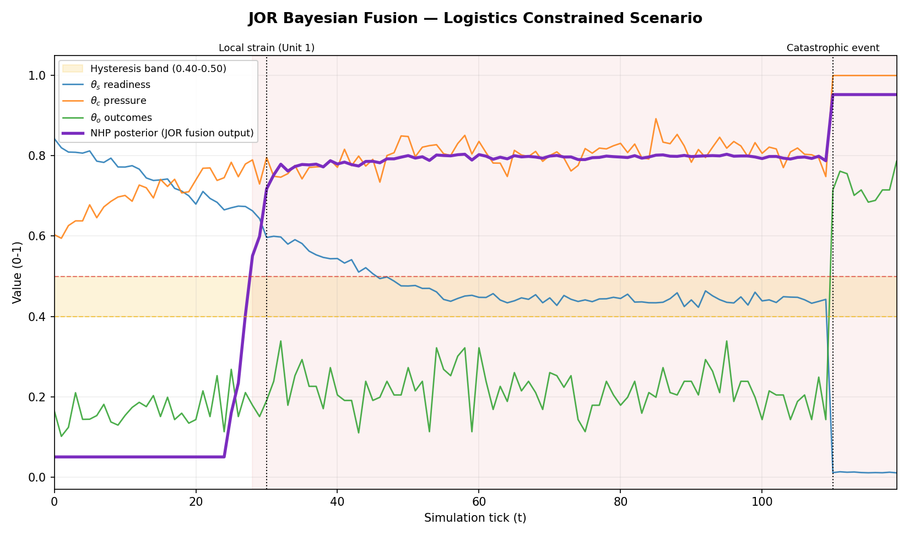

# JOR — Bayesian Sequential Fusion for Wargame-Style Anomaly Detection

JOR is a Bayesian posterior-fusion engine that tracks force health over time from
multiple noisy signals — readiness, operational pressure, and mission outcomes —
and produces a single, continuously updated probability that a force is in a
non-healthy state (NHP: non-healthy posterior).

It's built around a pattern that shows up broadly in sensor fusion and anomaly
detection: rather than alerting on a simple threshold ("if X > 0.5, alert"), it
treats each new reading as evidence, updates a posterior belief with it, and
blends that against prior state with a retention factor. This makes it resistant
to single noisy readings while still able to react quickly to a genuine,
sustained shift — including a catastrophic-override path for deviations large
enough that resisting them further would just delay a real alert.

The wargame scenario (readiness/morale/enemy posture/commander skill) is the
testbed used to exercise the fusion logic under realistic, noisy, multi-factor
conditions — not the point of the project on its own. The interesting part is
the fusion engine and how it behaves under stress, not the scenario dressing.

## How it works

1. **Calibration** — the engine observes the first N ticks of a run and learns
   a baseline "SOP" (signal object processing) score before making any health judgments,
   so the same absolute reading means different things in a high-tempo scenario
   versus a quiet one.
2. **Bayesian update** — each tick's deviation from baseline feeds a logistic
   likelihood, which updates a posterior via Bayes' rule.
3. **Retention blending** — the posterior is blended with its prior state
   (an exponential-smoothing-like retention factor) to avoid single-tick noise
   causing false alarms.
4. **Catastrophic override** — if deviation from baseline crosses a large
   threshold, retention increases sharply so the posterior can saturate quickly
   instead of lagging behind a real collapse.
5. **Hysteresis alerting** — the alert state uses separate upper/lower
   thresholds (rather than one cutoff) to avoid flapping in and out of alert on
   borderline readings.
6. **Near-collapse proximity tracking** — a strict "full collapse" signature
   requires several conditions to align on the exact same tick, which is
   appropriately hard to trigger and avoids false positives. But a strict
   AND-condition can also mask a near miss — a run where 3 of 4 conditions
   aligned and the 4th just missed looks identical to a run where nothing
   happened at all, unless you're also tracking how close it got. This layer
   reports that proximity explicitly instead of collapsing it into a single
   detected/not-detected result.

## Files

| File | Purpose |
|---|---|
| `engine.py` | The core `JOREngine` — calibration, Bayesian update, retention, catastrophic override, hysteresis alerting |
| `maneuver_adapter.py` | Converts raw scenario inputs (unit readiness, pressure, per-unit outcomes) into the three fused signals (theta_s, theta_c, theta_o), including outlier detection via median/IQR + persistent EMA |
| `logger.py` | Appends structured JSON-lines logs of every tick's fusion output and metadata |
| `maneuver_sim_interactive.py` | The interactive scenario driver — scenario presets, commander skill levels, enemy posture model, decision points, mission summary with collapse/near-collapse reporting |
| `plot_maneuver_log.py` | Reads a log file and renders a chart of the fused signals, NHP posterior, hysteresis band, and scripted event markers over time |

## Running it

```bash
pip install -r requirements.txt
python maneuver_sim_interactive.py
```

You'll be prompted to pick a scenario (1-5) and, as the run progresses, to make
periodic decisions in response to fatigue/pressure/outcome warnings. At the end
you'll get a mission summary including the collapse signature and near-collapse
proximity report.

To generate a chart from the resulting log:

```bash
python plot_maneuver_log.py maneuver_log_<scenario>.json
```

**Note:** the logger appends to its file rather than overwriting it, so running
the same scenario twice without deleting/renaming the log file in between will
concatenate two runs into one file. `plot_maneuver_log.py` detects this
automatically and plots only the most recent run by default (with a printed
note), but if you want a clean single-run log, delete the file before
re-running.

## Example output

A logistics-constrained run with a scripted coordination failure at tick 110:



```
Baseline SOP (t=0-24): 0.355
Final SOP (t=119):     0.932
Final NHP:              0.953
ALERT Duration:         92 steps (76.7%)
Collapse Signature:     FRIENDLY COLLAPSE
Enemy Proximity:        NEAR-COLLAPSE — 2/3 conditions aligned at t=26
```

## What this is, and isn't

This is a working demonstration of Bayesian sequential fusion applied to a
multi-signal health-monitoring problem — calibration, posterior updating,
retention-based smoothing, override behavior for genuine catastrophic
deviations, and hysteresis alerting are all real, functioning components, not
a simplified stand-in for them.

What it is *not* is a calibrated or validated model: the fusion weights
(0.40/0.30/0.30), thresholds (0.50/0.40), and scenario parameters are
illustrative rather than derived from historical data or domain expertise. A
production version of this pattern would calibrate those weights against real
outcome data — the way, for example, defense readiness reporting systems tie
resource and mission-capability ratings back to actual historical performance
rather than hand-set constants. The fusion *architecture* here is the real
contribution; the specific numbers plugged into it are a starting point for
tuning, not a finished result.
